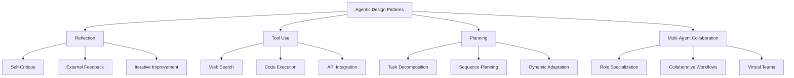
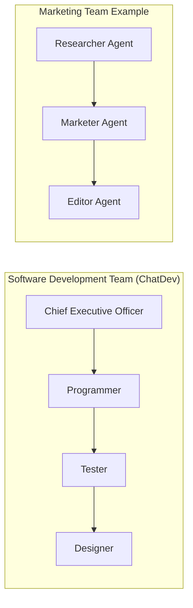

# Agentic Design Patterns Summary

## Overview

Agentic workflows are built by combining building blocks into complex sequences. This document summarizes the four key design patterns for building effective agentic workflows, as outlined in the source material.

## The Four Core Design Patterns



## 1. Reflection Pattern

### Description
The reflection pattern enables LLMs to examine and improve their own outputs through self-critique or external feedback mechanisms.

### How It Works
1. **Initial Generation**: LLM produces initial output (e.g., code)
2. **Critique Phase**: Same or different LLM reviews the output for:
   - Correctness
   - Style
   - Efficiency
3. **Iteration**: Based on feedback, the LLM generates improved versions

### Example Workflow
```
LLM → Generate Code → Critique Agent → Identify Issues → LLM → Improved Code v2 → ...
```

### Implementation Approaches
- **Single Agent**: Same LLM critiques its own work
- **Multi-Agent**: Dedicated critique agent reviews another agent's work
- **External Feedback**: Incorporate runtime errors, test results, or external validation

### Benefits
- Improved output quality
- Self-correcting capabilities
- Iterative refinement process

### Limitations
- Not 100% reliable
- May require multiple iterations
- Can be computationally expensive

## 2. Tool Use Pattern

### Description
LLMs are equipped with external tools (functions) they can call to extend their capabilities beyond text generation.

### Common Tool Categories

| Category | Examples | Use Cases |
|----------|----------|-----------|
| **Information Gathering** | Web search, database queries | Research, fact-checking |
| **Computation** | Code execution, calculators | Math, data analysis |
| **Productivity** | Email, calendar, file management | Task automation |
| **Media Processing** | Image generation, audio processing | Content creation |

### Example Applications
- **Research Questions**: "What's the best coffee maker?" → Web search tool
- **Mathematical Problems**: "Compound interest calculation" → Code execution tool
- **Data Analysis**: Complex calculations and visualizations

### Benefits
- Extends LLM capabilities significantly
- Enables real-time information access
- Supports complex computational tasks

### Implementation Considerations
- Tool selection and integration
- Error handling for tool failures
- Security and permission management

## 3. Planning Pattern

### Description
LLMs autonomously determine the sequence of actions needed to accomplish complex tasks, rather than following pre-programmed workflows.

### Key Characteristics
- **Dynamic Planning**: LLM decides the steps at runtime
- **Task Decomposition**: Complex tasks broken into manageable subtasks
- **Sequential Execution**: Steps executed in logical order

### Real-World Example: HuggingGPT
**Task**: "Generate an image where a girl is reading a book in the same pose as a boy in the image, then describe the new image in your voice."

**Planned Sequence**:
1. Use pose determination model to analyze boy's pose
2. Generate image of girl reading in same pose
3. Convert image description to speech

### Benefits
- Flexible, adaptive workflows
- Handles complex, multi-step tasks
- Reduces need for hard-coded sequences

### Challenges
- More experimental and harder to control
- Unpredictable execution paths
- Requires robust error handling

## 4. Multi-Agent Collaboration Pattern

### Description
Multiple specialized agents work together on complex tasks, similar to how human teams collaborate with different roles and expertise.

### Architecture Approaches



### Real-World Applications

#### ChatDev Framework
- **Roles**: CEO, Programmer, Tester, Designer
- **Function**: Virtual software company
- **Capability**: Complete software development projects

#### Marketing Brochure Example
- **Researcher Agent**: Conducts online research
- **Marketer Agent**: Writes marketing content
- **Editor Agent**: Polishes and refines text

### Benefits
- Specialized expertise per agent
- Better outcomes for complex tasks
- Mirrors human team dynamics
- Proven effectiveness in domains like:
  - Biography writing
  - Chess strategy
  - Software development

### Challenges
- Difficult to control and predict
- Complex coordination requirements
- Higher computational costs
- Debugging multi-agent interactions

## Implementation Best Practices

### 1. Pattern Selection
- **Simple Tasks**: Start with reflection or tool use
- **Complex Tasks**: Consider planning or multi-agent approaches
- **Hybrid Approaches**: Combine patterns for optimal results

### 2. Evaluation Strategy
- Develop robust evaluation metrics
- Continuous monitoring and improvement
- A/B testing different pattern combinations

### 3. Control Mechanisms
- Implement safeguards for autonomous planning
- Set boundaries for multi-agent interactions
- Provide fallback mechanisms

## Conclusion

These four design patterns provide a foundation for building sophisticated agentic workflows:

1. **Reflection** - Enables self-improvement and iteration
2. **Tool Use** - Extends capabilities beyond text generation
3. **Planning** - Provides autonomous task decomposition
4. **Multi-Agent Collaboration** - Leverages specialized expertise

The key to successful implementation lies in understanding when and how to combine these patterns effectively, while maintaining appropriate control mechanisms and evaluation processes.

## Next Steps

The reflection pattern is often the most accessible starting point, offering a "surprisingly simple to implement technique that can give the performance of your system sometimes a very nice bump."