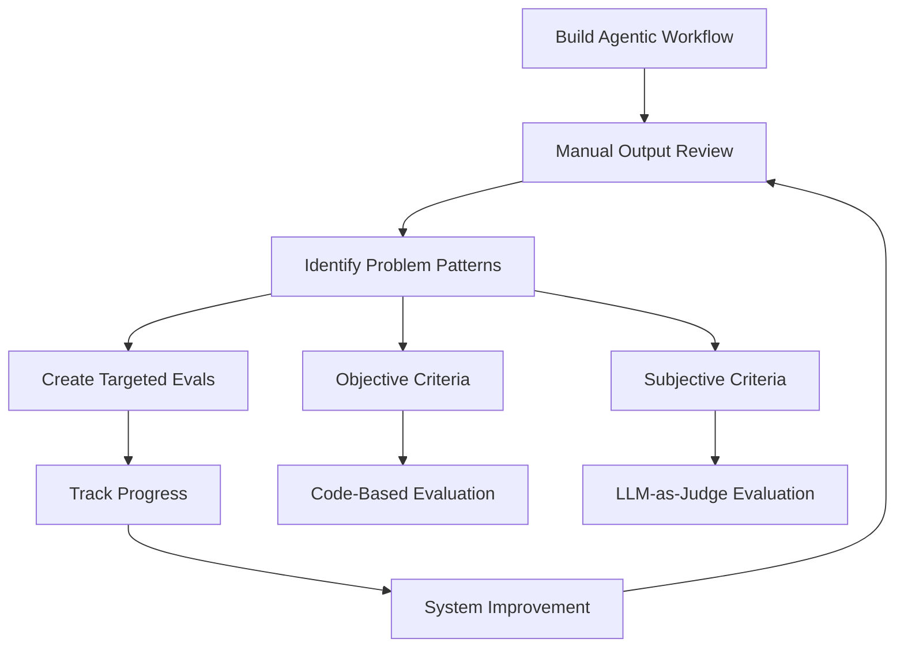
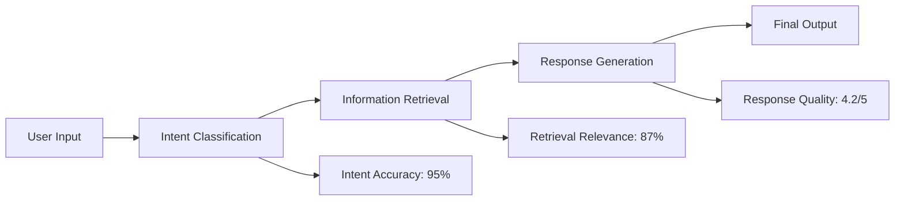

# Agentic Workflow Evaluation Strategies

## Overview

Evaluation (evals) is one of the biggest predictors of success when building agentic workflows. A disciplined evaluation process is crucial for building effective agentic systems. This document outlines key strategies and best practices for evaluating agentic workflows.

## Core Philosophy

> "Your ability to drive evals for your agentic workflow makes a huge difference in your ability to build them effectively."

### Build First, Evaluate Second

Rather than trying to anticipate all potential issues in advance:
1. **Build the initial workflow**
2. **Examine outputs manually** to identify problems
3. **Create targeted evaluations** for discovered issues
4. **Iterate and improve** based on evaluation results

## Evaluation Methodology



## Types of Evaluation Criteria

### 1. Objective Criteria

**Characteristics:**
- Binary outcomes (yes/no, present/absent)
- Can be evaluated programmatically
- Consistent and reproducible results

**Example: Competitor Mentions**

**Problem Scenario:**
```
Customer Service Agent Output:
"I'm glad you shopped with us. We're much better than our competitor, ComproCo."
"Sure, it should be fun. Unlike RivalCo, we make returns easy."
```

**Evaluation Implementation:**
```python
def evaluate_competitor_mentions(output_text, competitor_list):
    """
    Evaluate if output mentions competitors
    
    Args:
        output_text: Agent's response text
        competitor_list: List of competitor names
    
    Returns:
        dict: Evaluation results
    """
    mentions = []
    for competitor in competitor_list:
        if competitor.lower() in output_text.lower():
            mentions.append(competitor)
    
    return {
        'competitor_mentioned': len(mentions) > 0,
        'competitors_found': mentions,
        'mention_count': len(mentions)
    }

# Example usage
competitors = ['ComproCo', 'RivalCo', 'TheOtherCo']
result = evaluate_competitor_mentions(agent_output, competitors)
```

**Tracking Metrics:**
- Percentage of responses mentioning competitors
- Frequency of specific competitor mentions
- Trend analysis over time

### 2. Subjective Criteria

**Characteristics:**
- Quality-based assessments
- Require human-like judgment
- More nuanced evaluation needed

**Example: Research Quality Assessment**

**LLM-as-Judge Approach:**
```python
def evaluate_research_quality(essay_text):
    """
    Use LLM to evaluate research essay quality
    """
    prompt = f"""
    Assign the following essay a quality score between 1 and 5, 
    where 1 is the worst and 5 is the best essay.
    
    Consider factors like:
    - Accuracy of information
    - Depth of research
    - Clarity of writing
    - Structure and organization
    
    Essay: {essay_text}
    
    Provide your score and brief reasoning.
    """
    
    # Send to LLM and parse response
    return llm_judge(prompt)
```

**Sample Evaluation Results:**
| Topic | Score | Reasoning |
|-------|-------|-----------|
| Black Hole Science | 3/5 | Good information but lacks recent developments |
| Robot Fruit Harvesting | 4/5 | Comprehensive coverage with practical examples |

## Advanced Evaluation Types

### 1. End-to-End Evaluation

**Purpose:** Measure overall agent performance
**Scope:** Complete workflow from input to final output
**Metrics:**
- Task completion rate
- Output quality scores
- User satisfaction ratings
- Time to completion

### 2. Component-Level Evaluation

**Purpose:** Assess individual workflow steps
**Scope:** Single components or intermediate steps
**Benefits:**
- Isolate specific problem areas
- Optimize individual components
- Understand failure points

**Example Component Evaluations:**


## Error Analysis and Trace Examination

### Trace Analysis Process

1. **Capture Intermediate Outputs**
   - Log each step in the workflow
   - Record decision points and reasoning
   - Save intermediate data and transformations

2. **Manual Review Process**
   - Read through complete execution traces
   - Identify patterns in failures
   - Spot opportunities for improvement

3. **Pattern Recognition**
   - Common failure modes
   - Recurring error types
   - Performance bottlenecks

### Example Trace Analysis

```
Workflow Trace for Customer Inquiry:
Step 1: Intent Classification → "Product Return" (Confidence: 0.92)
Step 2: Policy Retrieval → Found 3 relevant policies
Step 3: Response Generation → Generated response mentioning competitor
Step 4: Final Output → ❌ FAILED (Competitor mention detected)

Analysis: Response generation step needs better filtering
```

## Evaluation Best Practices

### 1. Iterative Improvement Cycle

```mermaid
cycle
    title Evaluation Cycle
    "Build/Deploy" : "Create initial version"
    "Monitor" : "Track performance metrics"
    "Analyze" : "Review failures and patterns"
    "Improve" : "Update system based on findings"
```

### 2. Metric Selection Guidelines

**Objective Metrics (Preferred when possible):**
- Faster to compute
- More reliable and consistent
- Easier to automate
- Clear success/failure criteria

**Subjective Metrics (When necessary):**
- Use for quality assessments
- Consider multiple judges for reliability
- Provide clear evaluation criteria
- Be aware of LLM judge limitations

### 3. LLM-as-Judge Limitations

**Known Issues:**
- 1-5 scale ratings are often unreliable
- Bias toward certain response styles
- Inconsistent scoring across similar content
- May not capture nuanced quality differences

**Improvement Strategies:**
- Use comparative evaluation (A vs B)
- Provide specific evaluation criteria
- Use multiple judges and aggregate scores
- Validate against human judgments

## Implementation Framework

### 1. Evaluation Pipeline Setup

```python
class AgenticWorkflowEvaluator:
    def __init__(self):
        self.objective_evaluators = []
        self.subjective_evaluators = []
        self.trace_analyzers = []
    
    def add_objective_eval(self, evaluator):
        """Add code-based evaluation"""
        self.objective_evaluators.append(evaluator)
    
    def add_subjective_eval(self, evaluator):
        """Add LLM-based evaluation"""
        self.subjective_evaluators.append(evaluator)
    
    def evaluate_output(self, workflow_output, trace_data):
        """Run complete evaluation suite"""
        results = {
            'objective': {},
            'subjective': {},
            'trace_analysis': {}
        }
        
        # Run objective evaluations
        for evaluator in self.objective_evaluators:
            results['objective'].update(
                evaluator.evaluate(workflow_output)
            )
        
        # Run subjective evaluations
        for evaluator in self.subjective_evaluators:
            results['subjective'].update(
                evaluator.evaluate(workflow_output)
            )
        
        return results
```

### 2. Continuous Monitoring

**Key Metrics to Track:**
- Error rates by category
- Performance trends over time
- User satisfaction scores
- System reliability metrics

**Alerting Thresholds:**
- Competitor mention rate > 5%
- Quality score drops below 3.5/5
- Error rate increases by 20%
- Response time exceeds SLA

## Conclusion

Effective evaluation is the cornerstone of successful agentic workflow development. Key takeaways:

1. **Start Simple**: Build first, then evaluate based on observed issues
2. **Use Objective Metrics**: When possible, prefer code-based evaluation
3. **Complement with Subjective**: Use LLM judges for quality assessment
4. **Analyze Traces**: Manual review of intermediate steps reveals improvement opportunities
5. **Iterate Continuously**: Evaluation should be an ongoing process, not a one-time activity

The ability to drive disciplined evaluation processes is often the differentiating factor between teams that build effective agentic systems and those that struggle with reliability and performance issues.

## Next Steps

- Implement basic objective evaluations for your workflow
- Set up trace logging for error analysis
- Establish baseline metrics and improvement targets
- Create automated evaluation pipelines for continuous monitoring
