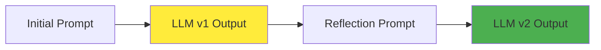
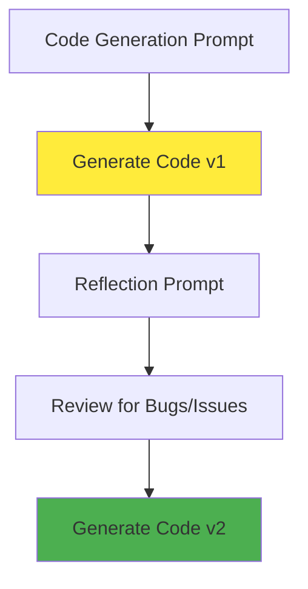
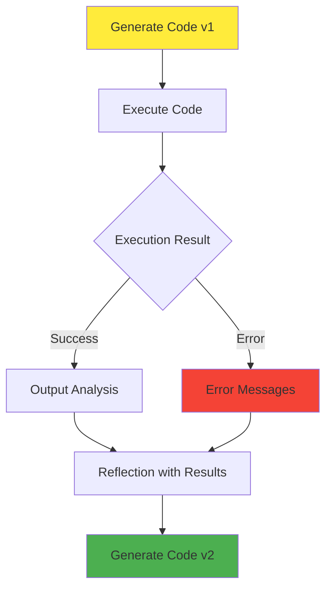
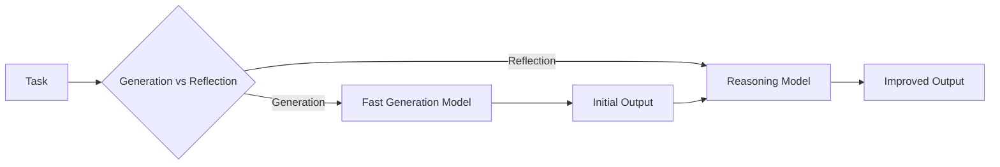

# Reflection Design Pattern - Deep Dive

## Overview

The reflection design pattern is surprisingly easy to implement and mirrors how humans naturally improve their work through self-review and iteration. This pattern enables LLMs to examine and enhance their own outputs, leading to significant quality improvements.

## Core Concept

Just as humans reflect on their work and find ways to improve it, LLMs can be prompted to review and enhance their outputs through a structured reflection process.

## Human Analogy: Email Writing

### Initial Draft (Human Example)
```
Hey Tommy,
Are you free for dinner next month? Let me know.
```

### Human Reflection Process
**Self-Review Identifies Issues:**
- "Next month" is too vague for scheduling
- Missing signature
- Lacks specific date options

### Improved Version
```
Hey Tommy,
Are you free for dinner on the 5th to the 7th? Let me know what works best.

Best regards,
[Your name]
```

## LLM Implementation

### Basic Reflection Workflow



### Email Example Implementation

**Step 1: Generate Initial Draft**
```python
def generate_initial_email(prompt):
    """Generate first draft of email"""
    return llm.generate(f"Write an email: {prompt}")

# Result: Email v1 (potentially flawed)
```

**Step 2: Reflection and Improvement**
```python
def reflect_and_improve_email(email_v1):
    """Reflect on email and generate improved version"""
    reflection_prompt = f"""
    Review this email and identify areas for improvement:
    {email_v1}
    
    Consider:
    - Clarity and specificity
    - Completeness
    - Professional tone
    - Missing information
    
    Write an improved version.
    """
    return llm.generate(reflection_prompt)

# Result: Email v2 (improved version)
```

## Code Generation with Reflection

### Basic Code Reflection



### Implementation Example

**Step 1: Initial Code Generation**
```python
def generate_code(task_description):
    """Generate initial code implementation"""
    prompt = f"Write Python code to {task_description}"
    return llm.generate(prompt)
```

**Step 2: Code Reflection**
```python
def reflect_on_code(code_v1):
    """Have LLM review and improve code"""
    reflection_prompt = f"""
    Review this code for bugs, efficiency, and style:
    
    ```python
    {code_v1}
    ```
    
    Check for:
    - Syntax errors
    - Logic bugs
    - Performance issues
    - Code style and readability
    
    Write an improved version.
    """
    return llm.generate(reflection_prompt)
```

## Advanced Reflection with External Feedback

### The Power of External Information

> "Reflection is much more powerful when there is new additional external information that you can ingest into the reflection process."

### Code Execution Feedback Loop



### Implementation with External Feedback

```python
import subprocess
import sys

def execute_code_safely(code):
    """Execute code and capture output/errors"""
    try:
        # Write code to temporary file
        with open('temp_code.py', 'w') as f:
            f.write(code)
        
        # Execute and capture output
        result = subprocess.run(
            [sys.executable, 'temp_code.py'],
            capture_output=True,
            text=True,
            timeout=30
        )
        
        return {
            'success': result.returncode == 0,
            'output': result.stdout,
            'errors': result.stderr
        }
    except Exception as e:
        return {
            'success': False,
            'output': '',
            'errors': str(e)
        }

def reflect_with_execution_feedback(code_v1):
    """Reflect on code using execution results"""
    
    # Execute the code
    execution_result = execute_code_safely(code_v1)
    
    # Create reflection prompt with execution feedback
    if execution_result['success']:
        feedback_prompt = f"""
        The code executed successfully with output:
        {execution_result['output']}
        
        Original code:
        ```python
        {code_v1}
        ```
        
        Review the code and output. Can you improve the code for:
        - Better performance
        - Cleaner output formatting
        - More robust error handling
        - Better code structure
        """
    else:
        feedback_prompt = f"""
        The code failed with error:
        {execution_result['errors']}
        
        Original code:
        ```python
        {code_v1}
        ```
        
        Fix the errors and write an improved version.
        """
    
    return llm.generate(feedback_prompt)
```

### Example: Syntax Error Correction

**Generated Code v1:**
```python
def calculate_sum(numbers):
    total = 0
    for num in numbers
        total += num  # Missing colon in for loop
    return total

print(calculate_sum([1, 2, 3, 4, 5])  # Missing closing parenthesis
```

**Execution Result:**
```
SyntaxError: invalid syntax (line 3)
```

**Reflection with Error Feedback:**
```python
def reflect_with_syntax_error(code, error_message):
    prompt = f"""
    This code has a syntax error:
    
    Code:
    {code}
    
    Error:
    {error_message}
    
    Fix the syntax error and return the corrected code.
    """
    return llm.generate(prompt)
```

**Improved Code v2:**
```python
def calculate_sum(numbers):
    total = 0
    for num in numbers:  # Fixed: Added colon
        total += num
    return total

print(calculate_sum([1, 2, 3, 4, 5]))  # Fixed: Added closing parenthesis
```

## Model Selection Strategies

### Different Models for Different Tasks



### Strategic Model Usage

**Generation Models:**
- Optimized for speed and creativity
- Good for initial drafts
- Examples: GPT-3.5, Claude Instant

**Reasoning Models:**
- Better at analysis and bug detection
- Stronger logical reasoning
- Examples: GPT-4, Claude-3, o1-preview

```python
class ReflectionWorkflow:
    def __init__(self, generation_model, reasoning_model):
        self.generation_model = generation_model
        self.reasoning_model = reasoning_model
    
    def generate_with_reflection(self, prompt):
        # Use fast model for initial generation
        initial_output = self.generation_model.generate(prompt)
        
        # Use reasoning model for reflection
        reflection_prompt = f"""
        Review and improve this output:
        {initial_output}
        
        Focus on accuracy, completeness, and quality.
        """
        
        improved_output = self.reasoning_model.generate(reflection_prompt)
        
        return {
            'initial': initial_output,
            'improved': improved_output
        }
```

## Design Considerations

### When Reflection Works Best

1. **External Feedback Available**
   - Code execution results
   - API responses
   - User feedback
   - Validation checks

2. **Clear Improvement Criteria**
   - Specific quality metrics
   - Well-defined standards
   - Objective measures

3. **Iterative Tasks**
   - Writing and editing
   - Code development
   - Problem-solving

### Limitations and Expectations

> "The reflection design pattern isn't magic. It does not make an LLM always get everything right 100% of the time, but it can often give it maybe a modest bump in performance."

**Realistic Expectations:**
- Modest performance improvements (10-30%)
- Not a silver bullet solution
- Works better with external feedback
- Quality depends on reflection prompts

## Implementation Best Practices

### 1. Structured Reflection Prompts

```python
def create_reflection_prompt(output, criteria):
    """Create structured reflection prompt"""
    return f"""
    Review the following output against these criteria:
    
    Output to review:
    {output}
    
    Evaluation criteria:
    {criteria}
    
    Steps:
    1. Identify specific issues or areas for improvement
    2. Explain why these are problems
    3. Provide an improved version
    4. Highlight the key changes made
    
    Improved version:
    """
```

### 2. Multi-Stage Reflection

```python
def multi_stage_reflection(initial_output):
    """Apply multiple reflection stages"""
    
    # Stage 1: Content review
    stage1 = reflect_on_content(initial_output)
    
    # Stage 2: Style and clarity
    stage2 = reflect_on_style(stage1)
    
    # Stage 3: Final polish
    final_output = reflect_on_polish(stage2)
    
    return final_output
```

### 3. Reflection with Validation

```python
def reflection_with_validation(output, validation_func):
    """Reflect until validation passes"""
    current_output = output
    max_iterations = 3
    
    for i in range(max_iterations):
        if validation_func(current_output):
            return current_output
        
        # Reflect and improve
        current_output = reflect_and_improve(
            current_output, 
            validation_feedback=validation_func.get_feedback()
        )
    
    return current_output
```

## Conclusion

The reflection design pattern is a powerful yet simple technique that can significantly improve LLM outputs. Key success factors:

1. **External Feedback Integration** - Most powerful when combined with execution results, validation, or other external information
2. **Strategic Model Selection** - Use different models for generation vs. reflection based on their strengths
3. **Structured Approach** - Clear reflection criteria and systematic improvement processes
4. **Realistic Expectations** - Modest but meaningful performance improvements, not perfection

The pattern works best when there are opportunities to inject new information into the reflection process, making it much more than simple self-review.
